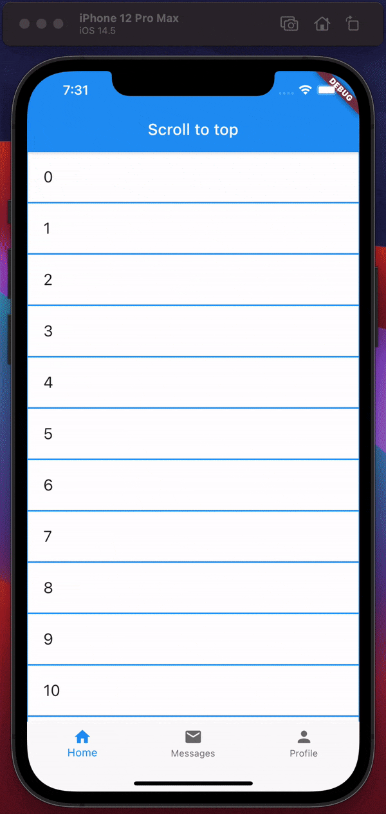

# Scrolls to top

A dart package for working with scrolls-to-top iOS feature

Why is this needed? 
This is necessary for those cases when you have several nested Scaffolds or you need to distinguish the tap event in the status bar from other scroll events



## Usage

Just wrap your main `Scaffold` with `ScrollsToTop` and provide `onScrollsToTop` argument

```dart
  @override
  Widget build(BuildContext context) {
    return ScrollsToTop(
      child: Scaffold(
        appBar: AppBar(title: const Text('Scroll to top')),
        body: _body(),
      ),
      onScrollsToTop: _onScrollsToTop,
    );
  }

  Future<void> _onScrollsToTop(ScrollToStartEvent event) async {
  }
```